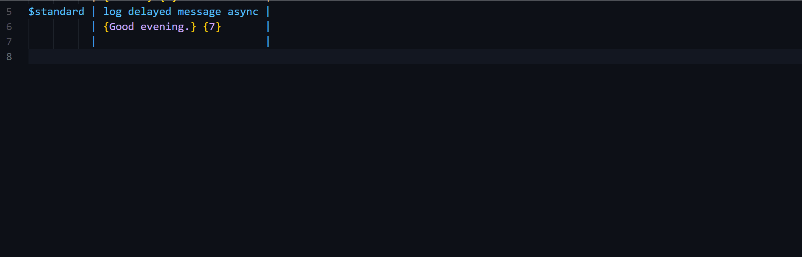
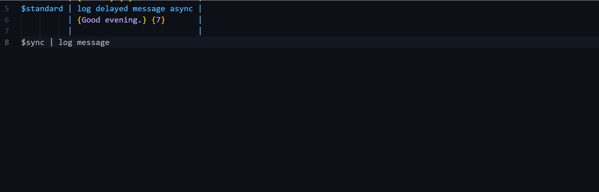
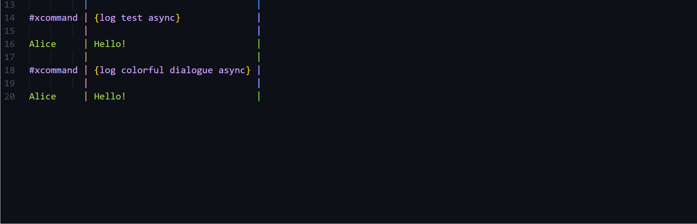
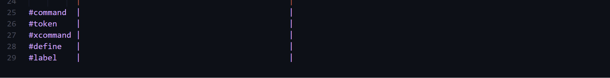

# SFText Utility

Utility for SFText. SFText is a script format used in ScenarioFlow.

See [here](https://github.com/dotprologue/ScenarioFlow.git) for details about ScenarioFlow.

This extension provides editing support like snippets for SFText.

Inserting command name snippets:

Inserting command arguments snippets:

Inserting extra dialogue arguments snippets:

Inserting macro snippets:

Moving the cursor:

Inserting new lines:

